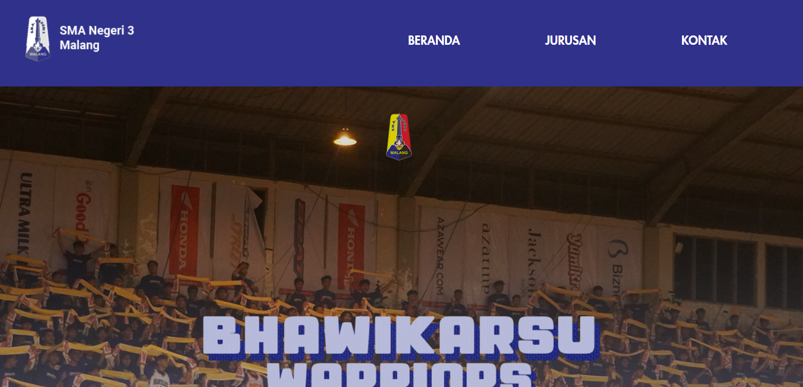
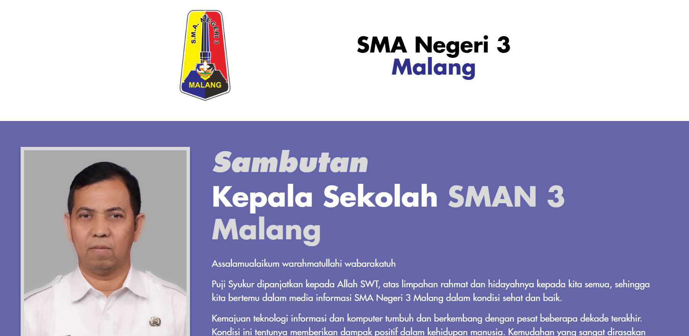
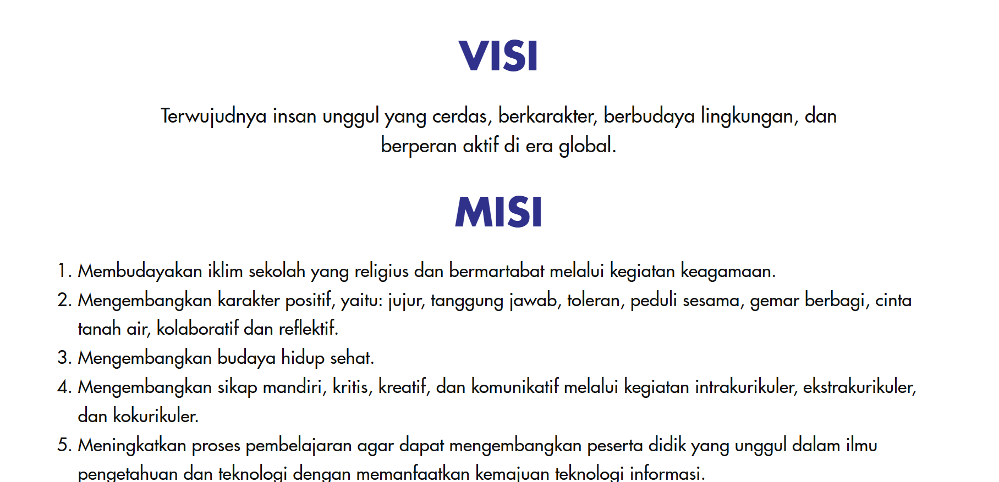
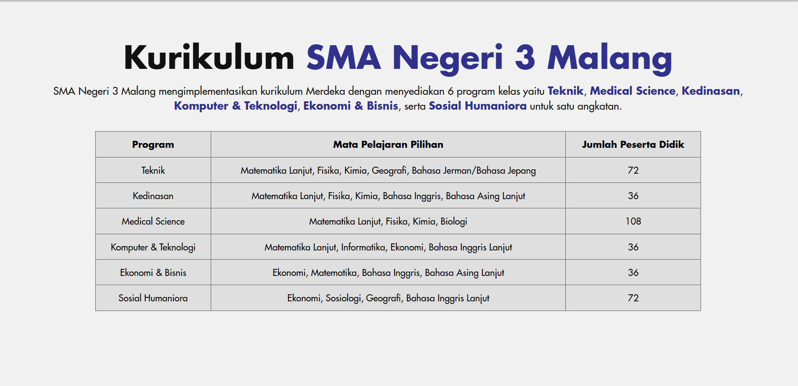
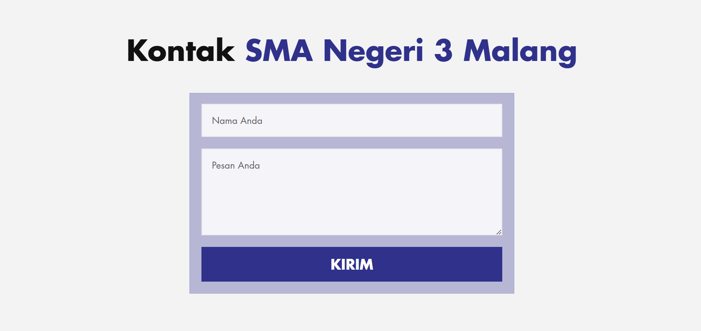
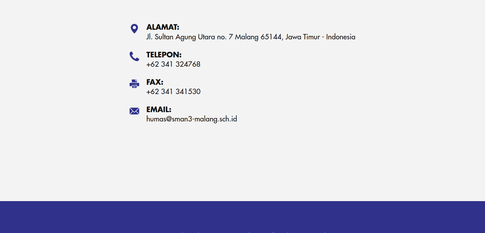

# Website SMA

Website sekolah statis untuk SMA Negeri 3 Malang yang dibuat dengan HTML dan CSS. Proyek ini menampilkan profil sekolah, visi-misi, kurikulum, serta halaman kontak.

## Referensi

[https://sman3-malang.sch.id/](https://sman3-malang.sch.id/)

## 📌 Gambaran Umum

Project ini dibuat sebagai landing page sekolah berbasis multi-page sederhana. Website ini terdiri dari beberapa halaman utama yang menampilkan informasi umum sekolah dan bagian kontak.

### Fitur Utama

- **Beranda:** Hero section, identitas sekolah, sambutan kepala sekolah, visi, dan misi.
- **Jurusan:** Informasi kurikulum dan daftar program jurusan beserta jumlah peserta didik.
- **Kontak:** Form pesan sederhana dan informasi kontak sekolah (alamat, telepon, fax, email).
- **Footer:** Link ke akun sosial media sekolah.

---

## 🛠️ Teknologi yang Digunakan

- **HTML5:** Struktur halaman menggunakan elemen semantik seperti `header`, `main`, `section`, dan `footer`.
- **CSS3:** Styling responsif, layout flexbox, tipografi, spacing, dan warna tema sekolah.

---

## 📁 Struktur File

```text
.
├── index.html          # Halaman utama/beranda
├── jurusan.html        # Halaman jurusan dan kurikulum
├── kontak.html         # Halaman kontak sekolah
├── style.css           # File styling utama
├── assets/
│   └── images/         # Logo, ikon, background, dan foto sekolah
└── README.md           # Dokumentasi proyek
```

---

## 🎨 Deskripsi Tampilan

Website ini menggunakan kombinasi warna biru gelap dan putih dengan gaya formal dan sekolah. Tampilan dibuat agar terlihat modern, rapi, dan konsisten dengan identitas SMA Negeri 3 Malang.

---

### Screenshot Preview









---

## 🔗 URL Website

[https://pweb-highschool.vercel.app/](https://pweb-highschool.vercel.app/)

